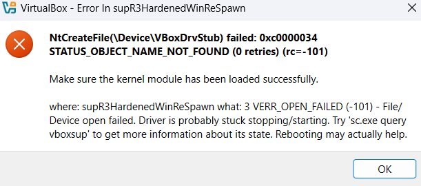

¡Gracias por compartir el resultado! Para activar el servicio `vboxsup`, puedes seguir estos pasos:

1. Abre una terminal o símbolo del sistema con privilegios de administrador.
2. Ejecuta el siguiente comando para iniciar el servicio manualmente:
   ```bash
   net start vboxsup
   ```
3. Si el comando se ejecuta correctamente, deberías ver un mensaje indicando que el servicio se inició con éxito.

Si el servicio no se inicia o encuentras algún error, verifica lo siguiente:
- Asegúrate de que VirtualBox esté instalado correctamente y que no haya archivos dañados.
- Revisa si algún software de seguridad (como antivirus) está bloqueando el servicio.
- Si el problema persiste, intenta reinstalar VirtualBox asegurándote de ejecutar el instalador como administrador.

Prueba esto y dime cómo te va. ¡Estoy aquí para ayudarte si necesitas más orientación! 😊